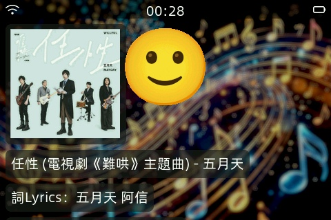

# 支援播放本地端/網路串流音樂 MP3 的小智 AI 聊天機器人


（[简体中文](README_zh.md) | 繁體中文 | [English](README_en.md) | [日本語](README_ja.md)）

---

#### 緣起

剛接觸「小智 AI 聊天機器人」時，對於網路上看到第三方支援網路串流音樂的版本很感興趣。不過找到的開源專案（例如 [Maggotxy/xiaozhi-esp32-music](https://github.com/Maggotxy/xiaozhi-esp32-music)）多為較舊的 v1.8.5，且串流音樂位址似乎已失效。

於是，我開始嘗試將第三方專案改寫成支援 Subsonic API 的版本，好處是可經由開源軟體在內網自行架設串流音樂平台。然而完成後發現程序容易崩潰重啟，在個人有限的程式能力和 AI 協助下，始終未能解決。

基於以上種種原因，決定從蝦哥的源代碼（[78/xiaozhi-esp32](https://github.com/78/xiaozhi-esp32)）開始進行二次開發，並參考先前第三方部分代碼，構建一套基於 v2.2.3+ 且能播放網路音樂串流的版本。

## 專案說明

基於 [78/xiaozhi-esp32 v2.2.3](https://github.com/78/xiaozhi-esp32/tree/b34a9b19baebfa17d8fcaa0ed494444aaba174e5) 聊天機器人的二次開發，新增播放 MP3 音樂功能：

- **支援兩種 MP3 音樂來源** *(註 1)*

  - 網路串流：透過 Subsonic API 播放音樂（使用 HTTP/HTTPS 傳輸）
  - 本地 SD 卡

- **歌詞同步顯示**

- **連續播放模式** *(註 2)*

  - 如果有多首歌曲，會隨機播放

- **專輯封面顯示** *(註 3)*

  - 顯示專輯圖片需要 PSRAM

*註解*：

1. *目前僅支援 MP3 音樂。開機時，設備會根據當下條件選擇 MP3 來源（SD 卡或網路），無法同時使用。*
2. *預設啟動為「單曲模式」，可用語音切換成「連續模式」，此設定會儲存在 NVS。*
3. *依照來源不同（如網路串流與 SD 卡），專輯封面的設定方法也不同。*

專案程式碼會引用 `ESP-ADF` 開發套件中的 `audio_stream` 與 `audio_pipeline` 組件。因此編譯本專案時，編譯環境中必須安裝 `ESP-ADF`。

此外，ESP-ADF 需補完 `config AUDIO_BOARD_CUSTOM` 的設置，以及 ESP-IDF 也必須進行修正。

實測支援 ESP32-S3 與 ESP32-C5、ESP32-C6，不支援最早期的 ESP32（資源不足），其他晶片未測試。使用 ESP-IDF 版本為 v5.5.3。


## 前提必要條件

- 您已具備編譯 [`78/xiaozhi-esp32`](https://github.com/78/xiaozhi-esp32) 源代碼的能力。

- 環境內已經安裝 `ESP-ADF`，並且：
  - 能成功編譯 `ESP-ADF` 內提供的 [`pipeline_http_mp3`範例](https://gitee.com/EspressifSystems/esp-adf/tree/release/v2.x/examples/player/pipeline_http_mp3) 
  - 或成功編譯其他範例（[**ESP-ADF 官方文件**](https://docs.espressif.com/projects/esp-adf/zh_CN/latest/get-started/index.html#vs-code-extension)）。

- 可存取 Subsonic API 的網路音樂串流平台，或是裝置支援讀取 SD 卡
  - 可在內網使用免費開源的軟體（如 Navidrome、Gonic、Airsonic）架設 Subsonic API 音樂串流平台。
  - 或是互聯網上支援 Subsonic API 的網路音樂串流平台。
  - 若沒有可用的網路音樂串流平台，那麼裝置至少得支援讀取 SD 卡。

## 兩種 MP3 音樂來源的選擇條件

裝置開機時會根據以下啟動條件，決定 MP3 音樂來源：

- 裝置開機時，若在 SD 卡根目錄中成功識別有`.xiaozhi-esp32.txt`檔案，則會使用該 SD 卡作為 MP3 音樂來源。
- 否則將以 http/https 使用 Subsonic API 存取網路音樂串流平台 MP3 資源。

### 使用 SD 卡作為音樂來源

[小智官網](https://my.feishu.cn/wiki/F5krwD16viZoF0kKkvDcrZNYnhb)提供眾多原生支援的裝置列表中，超過 9 成機型都沒有驅動 SD 卡（公版小智 AI 的功能不需 SD 卡），因此得自行參考設備文件並補完 SD 卡相關的程式碼，請參閱下方「[新增 SD 卡初始化程序](#1-2-新增-sd-卡初始化程序)」。

**SD 卡使用說明：**

- 以 FAT32 *（或 exFAT）* 格式化，並於根目錄中放置文件`.xiaozhi-esp32.txt`，文件內容不拘， 0 byte 也可以。
- 系統會以 SD 卡根目錄是否存在`.xiaozhi-esp32.txt`文件作為識別條件。成功識別之後，後續在搜尋歌曲時，會歷遍整張 SD 卡上所有的 MP3 檔案，並忽略 `.` 為首的隱藏目錄或檔案。
- SD 卡上不要有太長的檔案或目錄名稱，或是太深的目錄結構，否則可能在歷遍過程中發生崩潰。
- SD 卡上的 MP3 檔案名稱請遵循「`歌手 - 歌名.mp3`」原則。
- 因小智 AI 偏好簡體中文輸出，所以強烈建議中文歌曲 mp3 檔案使用簡體中文檔名，避免搜尋歌手/歌名時因繁簡中文出問題。範例如下：
  ```text
  周杰伦 - 安静.mp3
  时光机/五月天 - 时光机.mp3
  ```
- 使用 SD 卡時的歌詞外掛檔案與封面檔案：
  - 封面圖檔 (.jpg) 建議長寬小於 < 300 pixel，檔案建議小於 150KB，越小越好。
  - 歌詞檔（.lrc）或封面檔(.jpg) 必須和 MP3 音樂檔案放在同一目錄，範例如下：
  ```text
  范特西/周杰伦 - 安静.lrc
  范特西/周杰伦 - 安静.jpg
  范特西/周杰伦 - 安静.mp3
  知足/五月天 - 恋爱ing.lrc
  知足/五月天 - 恋爱ing.jpg
  知足/五月天 - 恋爱ing.mp3 
  ```
  *註：exFAT 請參考本文「[exFAT 的支援](#2-2-1-exfat-的支援)* 」

**使用 SD 卡的硬體限制**

ESP32 系列存取 SD 記憶卡，通常有兩種方式：
- SDMMC 控制器：目前僅 ESP32/S3/P4 搭載 SDMMC 控制器，其中 ESP32 的 SDMMC 為固定腳位，不允許自由變更。
- SPI 通道：ESP32 系列雖然有 2 至 3 組 SPI 通道，不過第 1 組用來與 Flash 記憶體通訊，可用的 SPI 只剩 1 至 2 組。

因此，若設備僅剩一組 SPI 通道可用（例如 ESP32-C 系列），以至於 SD 卡和 LCD 必須共用一組 SPI 通道的情形，可能會發生資源爭奪的異常，例如播放音樂超級卡頓、SPI 衝突崩潰重啟。
  - 若無法排除異常，只能在 LCD 與 SD 卡之間擇一取捨。

**建議使用搭載 SDMMC 控制器主控的開發板**：例如 ESP32-S3 與 ESP32-P4。

### 自行架設 Subsonic API 的網路音樂串流平台：

建議使用 [Navidrome](https://www.navidrome.org/)，優點如下：

- 開源免費，支援多平台（Windows / macOS / Linux / 樹莓派...）

- 單一執行檔，免安裝，技術門檻極低，架站 3 分鐘搞定。另有 Docker 的安裝方法，可安裝於 NAS 主機。

- Navidrome 支援同步歌詞，歌詞形式可用 ID3 內嵌（`LYRICS` 或 `UNSYNCEDLYRICS` 欄位）或外掛 .lrc 檔案。
  - 外掛歌詞僅須將 .lrc 歌詞文件與 .mp3 放在同一目錄下，使用相同主檔名即可。

- Navidrome 支持專輯封面，封面圖檔內嵌在 mp3 原始音樂檔案的 ID3 標籤欄位內。

- Navidrome 依賴 mp3 音樂檔案的 ID3 標籤進行建檔與搜尋，請確保 ID3 標籤 artist（歌手）和 title（歌名）欄位填寫正確完整。

  *註：可使用 [Mp3tag](https://www.mp3tag.de/en/download.html) 或其他工具編輯編輯 ID3 內容的歌手、歌名、專輯名稱、封面圖檔等欄位*

- 因語言模型偏好輸出簡體中文，建議中文歌曲的 ID3 標籤使用簡體中文填寫，以免搜尋不到。
  
  *註：Navidrome 的內建 Web 播放器，實測不支援同步歌詞顯示。所以請勿使用 Navidrome 內建 Web 播放器測試歌詞功能。*

## 如何編譯使用本專案

使用 `git clone` 指令下載專案源代碼

```shell
git clone https://github.com/benjenq/xiaozhi-esp32-music-player.git
```

### 1. 修改代碼

#### 1-1 新增`Mp3Player`播放器

所有的開發板（`waveshare-s3-touch-lcd-3.5b`除外）預設沒有引入播放串流音樂的功能，需在對應的開發板上進行少量代碼修改進行啟用。

- 可參考 [`waveshare-s3-touch-lcd-3.5b.cc`](main/boards/waveshare/esp32-s3-touch-lcd-3.5b/waveshare-s3-touch-lcd-3.5b.cc)）：

`#include`標頭段新增：

```cpp
#include "mp3_player.h"
```

類別宣告段 `class CustomBoard : public WifiBoard` （或根據您擁有開發板的宣告類別）新增：

```cpp
Mp3Player* music_player_ = nullptr;
```

新增播放器的初始化（若裝置支援立體聲，`Mp3Player`初始化參數可填入`true`），以及開發板初始化引入播放器，範例如下（需參照不同的開發板的初始化方法）：

```cpp
    void InitializeTools(){
        music_player_ = new Mp3Player(); //若裝置支援立體聲，可使用 new HttpMp3Player(true);
    }
    
    ...(其他代碼)...

    CustomBoard() : ...{
      ...(其他代碼)
      InitializeTools();
      ...(其他代碼)
    }
```

複寫 `GetMusicPlayer()` 方法：

```cpp
    virtual Mp3Player * GetMusicPlayer() override {
        return music_player_;
    }
```

#### 1-2 新增 SD 卡初始化程序

根據硬體規格，SDMMC 控制器或 SPI 通道兩者擇一即可：
- ESP32-S3/P4 請選擇 SDMMC
- 其他 ESP32 主控選擇 SPI

##### 1-2-1 使用 SDMMC

SDMMC 適用於 ESP32-S3/P4。（ESP32 的 SDMMC 腳位是固定的，不可自由指定。）

開發版 `config.h` 新增：（以下GPIO_NUM_## 必須根據使用的開發版或設備進行調整，不可直接套用）：

```cpp
//SD 卡
#define SDMMC_PIN_CLK       GPIO_NUM_11 //每張開發版的腳位都不一樣，通常與 SPI 的 SCLK 共用
#define SDMMC_PIN_CMD       GPIO_NUM_10 //每張開發版的腳位都不一樣，通常與 SPI 的 MOSI 共用
#define SDMMC_PIN_D0        GPIO_NUM_9  //每張開發版的腳位都不一樣，通常與 SPI 的 MISO 共用
#ifndef SDCARD_MOUNT_POINT
#define SDCARD_MOUNT_POINT  "/sdcard"
#endif
```

開發版初始化（.cc）`#include`標頭段新增：

```cpp
// SDMMC
#include "esp_vfs_fat.h"
#include "driver/sdmmc_host.h"
#include "sdmmc_cmd.h"
```

SDMMC 初始化程式碼：

```cpp
    void InitializeSDMMC() { //SDMMC 模式，從官方 DEMO 直接複製過來
        esp_err_t ret;
        esp_vfs_fat_sdmmc_mount_config_t mount_config = {
            .format_if_mount_failed = false,
            .max_files = 5,
            .allocation_unit_size = 16 * 1024};
        const char mount_point[] = SDCARD_MOUNT_POINT;
        ESP_LOGI(TAG, "Initializing SD card");

        ESP_LOGI(TAG, "Using SDMMC peripheral");

        // By default, SD card frequency is initialized to SDMMC_FREQ_DEFAULT (20MHz)
        // For setting a specific frequency, use host.max_freq_khz (range 400kHz - 40MHz for SDMMC)
        // Example: for fixed frequency of 10MHz, use host.max_freq_khz = 10000;
        sdmmc_host_t host = SDMMC_HOST_DEFAULT();

        sdmmc_slot_config_t slot_config = {};
        slot_config.cd = SDMMC_SLOT_NO_CD;
        slot_config.wp = SDMMC_SLOT_NO_WP;
        slot_config.width   = SDMMC_SLOT_WIDTH_DEFAULT;
        slot_config.flags = 0;
        slot_config.width = 1;

        slot_config.clk = SDMMC_PIN_CLK;
        slot_config.cmd = SDMMC_PIN_CMD;
        slot_config.d0 = SDMMC_PIN_D0;

        slot_config.flags |= SDMMC_SLOT_FLAG_INTERNAL_PULLUP;

        ESP_LOGI(TAG, "Mounting filesystem");
        sdmmc_card_t *card;
        ret = esp_vfs_fat_sdmmc_mount(mount_point, &host, &slot_config, &mount_config, &card);

        if (ret != ESP_OK)
        {
            if (ret == ESP_FAIL)
            {
                ESP_LOGE(TAG, "Failed to mount filesystem. "
                            "If you want the card to be formatted, set the EXAMPLE_FORMAT_IF_MOUNT_FAILED menuconfig option.");
            }
            else
            {
                ESP_LOGE(TAG, "Failed to initialize the card (%s). "
                            "Make sure SD card lines have pull-up resistors in place.",
                        esp_err_to_name(ret));
            }
            return;
        }
        ESP_LOGI(TAG, "Filesystem mounted");
    }

    ...(其他代碼)

    CustomBoard() : ...{
      ...(其他代碼)
      InitializeSDMMC();
      ...(其他代碼)
    }
```

##### 1-2-2 使用 SPI

開發版初始化程式碼(.cc): 

標頭新增：
```cpp
//SD Card
#include <esp_vfs_fat.h>
#include <driver/sdspi_host.h>
#include <sdmmc_cmd.h>
```

SD 卡使用 SPI：

```cpp
    void InitializeSpi() {
        spi_bus_config_t buscfg = {};
        buscfg.mosi_io_num = SDCARD_MOSI_PIN; //可能與 DISPLAY_MOSI_PIN 共用
        buscfg.miso_io_num = SDCARD_MISO_PIN;
        buscfg.sclk_io_num = SDCARD_CLK_PIN; //可能與 DISPLAY_CLK_PIN 共用
        buscfg.quadwp_io_num = GPIO_NUM_NC;
        buscfg.quadhd_io_num = GPIO_NUM_NC;
        buscfg.max_transfer_sz = DISPLAY_WIDTH * DISPLAY_HEIGHT * sizeof(uint16_t);
        ESP_ERROR_CHECK(spi_bus_initialize(SPI2_HOST, &buscfg, SPI_DMA_CH_AUTO));
    }
    void InitializeSdCard() {
        //🧩 Step 1：設定 SPI device（SD）
        sdmmc_host_t host = SDSPI_HOST_DEFAULT();
        host.slot = SPI2_HOST;
        //🧩 Step 2：設定 CS 腳
        sdspi_device_config_t slot_config = SDSPI_DEVICE_CONFIG_DEFAULT();
        slot_config.gpio_cs = SDCARD_CS_PIN;
        slot_config.host_id = SPI2_HOST;

        esp_vfs_fat_sdmmc_mount_config_t mount_config = {
            .format_if_mount_failed = false,
            .max_files = 5,
            .allocation_unit_size = 16 * 1024,
        };

        sdmmc_card_t* card;

        esp_err_t ret = esp_vfs_fat_sdspi_mount(
            SDCARD_MOUNT_POINT,
            &host,
            &slot_config,
            &mount_config,
            &card
        );
        if(ret != ESP_OK){
            ESP_LOGE(TAG, "esp_vfs_fat_sdspi_mount error: %d",ret);
        }
        else{
            ESP_LOGI(TAG, "esp_vfs_fat_sdspi_mount SD mount success: %d",ret);
        }
    }
    ...(其他代碼)...
    CompactWifiBoardLCD() :
        ...(其他代碼)...
        InitializeSpi();
        InitializeSdCard();
        ...(其他代碼)...
```

#### SD 卡程式碼快速總結：
- ESP32-S3/P4 使用 SDMMC 控制器讀寫 SD 卡。
- ESP32-S2 沒有 SDMMC 但是有兩組可用 SPI，SD 與 LCD 可分開使用。
- ESP32-C3/C5/C6 沒有 SDMMC 且只剩一組可用 SPI，LCD 與 SD 共用 SPI 可能出問題。

### 2. 修改 menuconfig 內容：

#### 2-1 Sousonic API 網址設定：
- Subsonic API 伺服器位址：根據實際情況填寫有效的串流音樂平台網址，含埠號，以`/rest`結尾，例如 `http://192.168.0.101:4533/rest`
- Subsonic API 的基本參數：有兩種固定格式，擇一：
  - `u=帳號&p=密碼&s=raw&v=1.16.1&c=xiaozhi`
  - `u=帳號&s=任意字串&t=密碼結合任意字串的MD5生成碼&v=1.16.1&c=xiaozhi`

#### 2-2 與 SD 卡有關之`menuconfig`設定

啟用長檔名與中文檔名支援：
```
Component config -> FAT Filesystem support
```
- 長檔名支援：`Long filename support` 選擇 `Long filename buffer in heap (CONFIG_FATFS_LFN_HEAP=y)`
- 中文檔名支援：`API character encoding` 選擇 `API uses UTF-8 encodning (CONFIG_FATFS_API_ENCODING_UTF_8=y)`

#### 2-2-1 **exFAT 的支援：**

ESP-IDF 預設不啟用 exFAT 支援，也不在 `menuconfig` 設定啟用，原因是微軟將 exFAT 專利納入 Open Invention Network (OIN) 保護範圍，MCU 韌體不在範圍內。

因此，支援 exFAT 需要「自行 Patch 原始碼」如下：

1. 修改 `$IDF_PATH/components/fatfs/src/ffconf.h`:
   - FF_FS_EXFAT 改為 1
   - FF_LBA64 改為 1

   *註：修改者需自行評估相關法律與授權風險。*
2. `menuconfig` 的 `Component config -> FAT Filesystem support`
   - `Long filename support` 開啟長檔名支援。
   - `Use FATFS volume label (CONFIG_FATFS_USE_LABEL)` 必須勾選。

### 3. 小智機器人後台設定

智能體 - 角色配置 - 角色介紹，新增提示詞，

```text
收到音乐相关的需求时，只使用 MCP 工具 self.music.play_song，同时禁止使用 search_music 功能。播放成功时回覆播放讯息。
```

並且到小智機器人後台的 MCP 工具中，關閉預設的音樂播放功能，避免系統出現兩個 MCP 音樂播放工具而互搶任務。

### 4. ESP-ADF 的補完，以及 ESP-IDF 的修正

#### 4.1  ESP-ADF 的修正：補完 `config AUDIO_BOARD_CUSTOM`

本專案使用並引入 ESP-ADF 開發套件中兩個組件：`audio_stream` 與 `audio_pipeline`，並參考官方範例[`pipeline_http_mp3`](https://gitee.com/EspressifSystems/esp-adf/tree/master/examples/player/pipeline_http_mp3)。這個範例中，僅一百多行就處理了區塊下載、緩存管理、mp3 檔案分析與解碼、音頻採樣等複雜的工作。

雖然本專案只用到兩個組件，不過由於 ESP-ADF 組件的相依性，必須引入 ESP-IDF 中的 `audio_board` 組件（本專案已引入），否則專案會編譯失敗。

專案引入 `audio_board` 組件後，menuconfig 會出現 `Audio HAL - Audio board` 項目，必須選擇開發板，否則也會編譯失敗。

然而 `Audio board` 開發板清單又與小智 AI 專案的支援開發板清單不太相同，隨便選還會導致編譯失敗，所以必須「**補完 Custom audio board 的最少設定**」。概述如下：

1. `esp-adf/components/audio_board` 新增目錄 `esp_audio_board_custom`

2. 將 `esp-adf/components/audio_board/esp32_c6_devkit/` 底下的檔案複製到 `esp_audio_board_custom/` 目錄下

3. 修改 `esp-adf/components/audio_board/CMakeLists.txt` 新增：
   
   ```cmake
   if (CONFIG_AUDIO_BOARD_CUSTOM)
   message(STATUS "Current board name is " CONFIG_AUDIO_BOARD_CUSTOM)
   list(APPEND COMPONENT_ADD_INCLUDEDIRS ./esp_audio_board_custom)
   set(COMPONENT_SRCS
   ./esp_audio_board_custom/board.c
   ./esp_audio_board_custom/board_pins_config.c
   )
   endif()
   ```

4. 修改 `esp_audio_board_custom/` 目錄內的所有有關 GPIO PIN 的定義內容：
   
   - `GPIO_NUM_數字` 全改為 `GPIO_NUM_NC`
   - `board_def.h` 內補足 `ESP_SD_PIN_##` 的`D0` ~ `D7` ，以及 `ESP_SD_PIN_CD` 與 `ESP_SD_PIN_WP`。

5. 編譯時 `Audio HAL - Audio board` 選擇 `Custom audio board`。

以上操作可避免編譯 ESP-ADF 的 audio_board 組件時發生錯誤。

#### 4.2 ESP-IDF 的修正

ESP-ADF 的某些組件會用到 ESP-IDF 中不存在的方法，所以 ESP-IDF 需要修正，否則組件的功能可能會發生異常。修正的指令位於 `esp-adf/idf_patches` 內：

- 須根據 ESP-IDF 的版本，選擇對應的修正指令。

- 修正的指令為 *(以下是 macOS 環境變數為例)*：
  
  ```shell
  cd $IDF_PATH
  git apply --ignore-space-change $ADF_PATH/idf_patches/idf_vX.X_freertos.patch
  ```
  
  X.X 為 ESP-IDF 的版本。個人實測 ESP-IDF v5.5.2 版有效。

### 逐一完成上述的操作，便可編譯和刷寫本專案韌體。

## 使用操作

播放音樂：說出自然語言命令

```text
播放音樂
我想聽周董的歌
播放五月天的音樂
播放周杰倫的花海
播放歌曲痛哭的人
...
```

*注意事項：*
- *如果設備支援喚醒詞功能，播放音樂時將暫時停用，音樂停止則恢復。*
- *中斷播放音樂需使用 BOOT 鍵。*
- *若未明確提到歌手與歌曲時，通常會隨機選播，但也有可能失敗，其結果因語言模型的理解能力而定。*

播放模式切換：

- 使用`「設置單曲模式」`、`「設定連播模式」`等類似命令切換。
- 有時 AI 會假回覆但其實沒有調用 MCP，命令加上「工具」可改善這個問題，如`「工具設置連播模式」`。

單曲模式：

- 播放完一首歌曲結束後，會進入聆聽命令模式，等待語音命令。

連續播放模式：

- 只要有找到歌，就會一直播放。音樂超過兩首時，會隨機選取。
- 必須用 BOOT 按鈕中斷連續播放。

## 其他說明

### 修改的程式代碼文件

從 [78/xiaozhi-esp32](https://github.com/78/xiaozhi-esp32) 修改的內容如下：

新增代碼文件：

| 文件名稱                                 | 說明      |
| ------------------------------------ | ------- |
| main/boards/common/music_player.h    | 播放器虛擬介面 |
| main/boards/common/mp3_player.h      | 播放器程序   |
| main/boards/common/mp3_player.cc      | 同上      |
| main/boards/common/mp3_player_http.cc | 同上，有關 http 的程序 |
| main/boards/common/mp3_player_fatfs.cc | 同上，有關 SD 卡的程序 |

修改代碼文件：

| 文件名稱                                             | 說明                                                                 |
| --------------------------------------------------- | ------------------------------------------------------------------ |
| main/assets/locales/zh-CN,zh-TW,en-US/language.json | 新增音樂播放提示多語系。                                                       |
| sdkconfig.defaults.xxxx                             | 新增 CONFIG_FREERTOS_ENABLE_BACKWARD_COMPATIBILITY=y (編譯 ESP-ADF 必要)與 SD 長檔名、中文檔名支援。 |
| idf_component.yml                                   | 新增 bblanchon/arduinojson （解析流 JSON API）與 espressif/esp_lv_decoder 組件（封面 JPEG/PNG 解碼）|
| CMakeLists.txt                                      | 新增 ESP-ADF 組件。                                                     |
| main/CMakeLists.txt                                 | 加入新增的源碼，並搭配根目錄 CMakeLists.txt 的相關修改。                               |
| main/application.cc                                 | 切換聊天狀態時，停止音樂播放 。                                                  |
| main/Kconfig.projbuild                              | 加入 Subsonic API 相關項目，修改串流音樂位址不需修改代碼。                               |
| main/audio/audio_codec.h                            | 定義切換音樂和語音的 立體聲/單聲道 與 Sample Rate 接口。                                  |
| main/audio/audio_codec.cc                           | 接口的實作。                                                                |
| main/audio/codecs/**.cc                             | 加入`original_std_tx_cfg_ = std_cfg;`儲存 I2S 初始設定，用來恢復 codec 預設值。     |
| main/audio/audio_service.cc                         | 中斷音頻輸出加入音樂播放判定，避免播放音樂時被系統中斷輸出。                                     |
| main/led/single_led.h,single_led.cc                 | 將`SingleLed`設定顏色、亮度的私有方法與宏定義改為公開。                                     |
| main/boards/common/board.h                          | 新增音樂播放器的虛擬介面。                                                      |
| main/boards/common/board.cc                         | 同上。                                                                |
| main/boards/common/power_save_timer.cc              | 啟用電源管理程序時，播放音樂不進入省電模式判定。                                           |
| main/boards/common/sleep_timer.cc                   | 啟用裝置睡眠模式時，播放音樂不進入省電模式判定。                                           |

[這裡](https://github.com/benjenq/xiaozhi-esp32-music-player/commit/6ec4ef7fcc7d4a1b56a6a167324ef183fa456824)可以查看具體修改了哪些部分。

### ESP32 主控實測結果

使用開發版+外設如下：
- ESP32:
  NodeMCU-32s + [ILI9341 LCD 240x320](https://www.lcdwiki.com/zh/2.8inch_SPI_Module_ILI9341_SKU:MSP2807) + INMP441 麥克風 + MAX98357A 或 PCM5102A(立體聲)
- ESP32-C5:
  - 微雪 [ESP32-C5-WIFI6-KIT-N16R8]() + [ILI9341 LCD 240x320](https://www.lcdwiki.com/zh/2.8inch_SPI_Module_ILI9341_SKU:MSP2807) + INMP441 麥克風 + MAX98357A 或 PCM5102A(立體聲)
- ESP32-C6:
  - 微雪 [ESP32-C6-Zero](https://www.waveshare.net/shop/ESP32-C6-Zero.htm) + INMP441 麥克風 + MAX98357A 或 PCM5102A(立體聲)，沒有加掛 LCD
  - 微雪 [ESP32-C6-Touch-LCD-1.47](https://www.waveshare.net/shop/ESP32-C6-Touch-LCD-1.47.htm) + INMP441 麥克風 + MAX98357A 或 PCM5102A(立體聲)
- ESP32-S3:
  - 微雪 [ESP32-S3-Touch-LCD-2.8](https://www.waveshare.net/shop/ESP32-S3-Touch-LCD-2.8.htm)(內建立體聲功放) + INMP44 麥克風
  - 微雪 [ESP32-S3-Touch-LCD-3.5B-C](https://www.waveshare.net/shop/ESP32-S3-Touch-LCD-3.5B-C.htm)，內建單音功放與麥克風，小智 AI 官方支援

**實測結果**

|主控 / 開發版 | PSRAM | 小智 AI | http 音樂播放 | SD 卡音樂播放 | 說明 |
|-----------|-------|---------|-------------|--------------|----|
|ESP32     | ✘     | ✔       | ✘           | ✘  | 播放失敗(內存連續空間不足)|
|ESP32-C5  | 8M  | ✔        | ✔           | ▲  | LCD / SD 共用 SPI 導致資源掠奪|
|ESP32-C6-Touch-LCD-1.47  | ✘  | ✔        | ✔           | ✔▲  | SD 與 LCD 可共用，需大幅優化配置|
|ESP32-C6-Zero  | ✘  | ✔        | ✔           | ✔  | 沒有 LCD |
|ESP32-S3 | 8M |  ✔        | ✔           | ✔ | 從從容容 游刃有餘|

#### ESP32-C5 注意事項

ESP32-C5 硬體較新，搭載 PSRAM 且時脈比 ESP32-C6 高，但實測發現有些功能尚未完全穩定，例如 SD 與 LCD 共享 SPI 的表現甚至比 ESP32-C6 還差。

#### ESP32-C6 注意事項

ESP32-C6 因資源與效能有限，若沒有優化配置，容易出現間歇斷音、播放音樂中斷，甚至於崩潰重啟等現象。

**1. 建議以下優化配置：**

- 顯示風格(`display style`) 選擇`預設訊息風格（Enabled default message style）`，不使用微信對話風格。
  - 預設訊息風格並不需要觸控功能，因為不顯示歷史對話紀錄，所以能大幅節省記憶體資源。
  - 若 ESP32-C6 裝置搭載 LCD + 觸控，請移除所有與觸控相關的程式碼，避免觸控事件干擾音源管線運作。
- 若 ESP32-C6 裝置不支援立體聲輸出（例：僅一顆揚聲器，沒有實體立體聲輸出線路等），建議程式碼中關閉立體聲支援，可節省更多記憶體資源。
  - 修改方式可參閱下方「[修改代碼](#1-修改代碼)」。
- 若發生 LCD / SD 資源衝突時，可嘗試調整 `SpiLcdDisplay` 初始化代碼中 `port_cfg.task_priority` 改為 `= 2`，

**2. 串流音樂平台使用 https 連線時：**

- https 會消耗更多的 CPU 與記憶體資源，ESP32-C6 運作頻率較低且沒有 PSRAM，播放音樂時有可能偶爾出現斷音、甚至播放中斷等現象。

**3. 立體聲播放：**

- 當播放音源為立體聲時，啟用立體聲支援會耗用更多記憶體，對資源有限的 ESP-C6 更是雪上加霜。

#### ESP32-C5/C6 可考慮捨棄螢幕顯示功能
- 程式碼中的屏幕類型用 `NoDisplay` 替代，對話詞、歌詞等內容， `NoDisplay` 會自動導向終端機輸出。
- 操作小智 AI 只需要語音和 BOOT 按鈕，LCD 螢幕僅顯示訊息，除了觸控螢幕可捲動對話紀錄之外（需啟用微信對話風格），等同於沒有交互功能。
- 可經由開發版上的 RGB LED 燈號顏色與語音判斷運作狀態。
- 大幅節省記憶體用量，也避免 LCD 與 SD 互搶 SPI 通道資源。
- 對 C6 而言，少了 LCD 與觸控之後，可開啟喚醒詞、https 連線、立體聲等功能。

---

# An MCP-based Chatbot

（[简体中文](README_zh.md) | 繁體中文 | [English](README_en.md) | [日本語](README_ja.md)）

## 介绍

👉 [人类：给 AI 装摄像头 vs AI：当场发现主人三天没洗头【bilibili】](https://www.bilibili.com/video/BV1bpjgzKEhd/)

👉 [手工打造你的 AI 女友，新手入门教程【bilibili】](https://www.bilibili.com/video/BV1XnmFYLEJN/)

小智 AI 聊天机器人作为一个语音交互入口，利用 Qwen / DeepSeek 等大模型的 AI 能力，通过 MCP 协议实现多端控制。


### 版本说明

当前 v2 版本与 v1 版本分区表不兼容，所以无法从 v1 版本通过 OTA 升级到 v2 版本。分区表说明参见 [partitions/v2/README.md](partitions/v2/README.md)。

使用 v1 版本的所有硬件，可以通过手动烧录固件来升级到 v2 版本。

v1 的稳定版本为 1.9.2，可以通过 `git checkout v1` 来切换到 v1 版本，该分支会持续维护到 2026 年 2 月。

### 已实现功能

- Wi-Fi / ML307 Cat.1 4G
- Offline voice wake-up [ESP-SR](https://github.com/espressif/esp-sr)
- Supports two communication protocols ([Websocket](docs/websocket.md) or MQTT+UDP)
- Uses OPUS audio codec
- Voice interaction based on streaming ASR + LLM + TTS architecture
- Speaker recognition, identifies the current speaker [3D Speaker](https://github.com/modelscope/3D-Speaker)
- OLED / LCD display, supports emoji display
- Battery display and power management
- Multi-language support (Chinese, English, Japanese)
- Supports ESP32-C3, ESP32-S3, ESP32-P4 chip platforms
- Device-side MCP for device control (Speaker, LED, Servo, GPIO, etc.)
- Cloud-side MCP to extend large model capabilities (smart home control, PC desktop operation, knowledge search, email, etc.)
- Customizable wake words, fonts, emojis, and chat backgrounds with online web-based editing ([Custom Assets Generator](https://github.com/78/xiaozhi-assets-generator))

## Hardware

### Breadboard DIY Practice

See the Feishu document tutorial:

👉 ["XiaoZhi AI Chatbot Encyclopedia"](https://ccnphfhqs21z.feishu.cn/wiki/F5krwD16viZoF0kKkvDcrZNYnhb?from=from_copylink)

Breadboard demo:


### Supports 70+ Open Source Hardware (Partial List)

- <a href="https://oshwhub.com/li-chuang-kai-fa-ban/li-chuang-shi-zhan-pai-esp32-s3-kai-fa-ban" target="_blank" title="LiChuang ESP32-S3 Development Board">LiChuang ESP32-S3 Development Board</a>
- <a href="https://github.com/espressif/esp-box" target="_blank" title="Espressif ESP32-S3-BOX3">Espressif ESP32-S3-BOX3</a>
- <a href="https://docs.m5stack.com/zh_CN/core/CoreS3" target="_blank" title="M5Stack CoreS3">M5Stack CoreS3</a>
- <a href="https://docs.m5stack.com/en/atom/Atomic%20Echo%20Base" target="_blank" title="AtomS3R + Echo Base">M5Stack AtomS3R + Echo Base</a>
- <a href="https://gf.bilibili.com/item/detail/1108782064" target="_blank" title="Magic Button 2.4">Magic Button 2.4</a>
- <a href="https://www.waveshare.net/shop/ESP32-S3-Touch-AMOLED-1.8.htm" target="_blank" title="Waveshare ESP32-S3-Touch-AMOLED-1.8">Waveshare ESP32-S3-Touch-AMOLED-1.8</a>
- <a href="https://github.com/Xinyuan-LilyGO/T-Circle-S3" target="_blank" title="LILYGO T-Circle-S3">LILYGO T-Circle-S3</a>
- <a href="https://oshwhub.com/tenclass01/xmini_c3" target="_blank" title="XiaGe Mini C3">XiaGe Mini C3</a>
- <a href="https://oshwhub.com/movecall/cuican-ai-pendant-lights-up-y" target="_blank" title="Movecall CuiCan ESP32S3">CuiCan AI Pendant</a>
- <a href="https://github.com/WMnologo/xingzhi-ai" target="_blank" title="WMnologo-Xingzhi-1.54">WMnologo-Xingzhi-1.54TFT</a>
- <a href="https://www.seeedstudio.com/SenseCAP-Watcher-W1-A-p-5979.html" target="_blank" title="SenseCAP Watcher">SenseCAP Watcher</a>
- <a href="https://www.bilibili.com/video/BV1BHJtz6E2S/" target="_blank" title="ESP-HI Low Cost Robot Dog">ESP-HI Low Cost Robot Dog</a>

<div style="display: flex; justify-content: space-between;">
  <a href="docs/v1/lichuang-s3.jpg" target="_blank" title="LiChuang ESP32-S3 Development Board">
    
  </a>
  <a href="docs/v1/espbox3.jpg" target="_blank" title="Espressif ESP32-S3-BOX3">
    
  </a>
  <a href="docs/v1/m5cores3.jpg" target="_blank" title="M5Stack CoreS3">
    
  </a>
  <a href="docs/v1/atoms3r.jpg" target="_blank" title="AtomS3R + Echo Base">
    
  </a>
  <a href="docs/v1/magiclick.jpg" target="_blank" title="Magic Button 2.4">
    
  </a>
  <a href="docs/v1/waveshare.jpg" target="_blank" title="Waveshare ESP32-S3-Touch-AMOLED-1.8">
    
  </a>
  <a href="docs/v1/lilygo-t-circle-s3.jpg" target="_blank" title="LILYGO T-Circle-S3">
    
  </a>
  <a href="docs/v1/xmini-c3.jpg" target="_blank" title="XiaGe Mini C3">
    
  </a>
  <a href="docs/v1/movecall-cuican-esp32s3.jpg" target="_blank" title="CuiCan">
    
  </a>
  <a href="docs/v1/wmnologo_xingzhi_1.54.jpg" target="_blank" title="WMnologo-Xingzhi-1.54">
    
  </a>
  <a href="docs/v1/sensecap_watcher.jpg" target="_blank" title="SenseCAP Watcher">
    
  </a>
  <a href="docs/v1/esp-hi.jpg" target="_blank" title="ESP-HI Low Cost Robot Dog">
    
  </a>
</div>

## Software

### Firmware Flashing

For beginners, it is recommended to use the firmware that can be flashed without setting up a development environment.

The firmware connects to the official [xiaozhi.me](https://xiaozhi.me) server by default. Personal users can register an account to use the Qwen real-time model for free.

👉 [Beginner's Firmware Flashing Guide](https://ccnphfhqs21z.feishu.cn/wiki/Zpz4wXBtdimBrLk25WdcXzxcnNS)

### Development Environment

- Cursor or VSCode
- Install ESP-IDF plugin, select SDK version 5.4 or above
- Linux is better than Windows for faster compilation and fewer driver issues
- This project uses Google C++ code style, please ensure compliance when submitting code

### Developer Documentation

- [Custom Board Guide](docs/custom-board.md) - Learn how to create custom boards for XiaoZhi AI
- [MCP Protocol IoT Control Usage](docs/mcp-usage.md) - Learn how to control IoT devices via MCP protocol
- [MCP Protocol Interaction Flow](docs/mcp-protocol.md) - Device-side MCP protocol implementation
- [MQTT + UDP Hybrid Communication Protocol Document](docs/mqtt-udp.md)
- [A detailed WebSocket communication protocol document](docs/websocket.md)

## Large Model Configuration

If you already have a XiaoZhi AI chatbot device and have connected to the official server, you can log in to the [xiaozhi.me](https://xiaozhi.me) console for configuration.

👉 [Backend Operation Video Tutorial (Old Interface)](https://www.bilibili.com/video/BV1jUCUY2EKM/)

## Related Open Source Projects

For server deployment on personal computers, refer to the following open-source projects:

- [xinnan-tech/xiaozhi-esp32-server](https://github.com/xinnan-tech/xiaozhi-esp32-server) Python server
- [joey-zhou/xiaozhi-esp32-server-java](https://github.com/joey-zhou/xiaozhi-esp32-server-java) Java server
- [AnimeAIChat/xiaozhi-server-go](https://github.com/AnimeAIChat/xiaozhi-server-go) Golang server
- [hackers365/xiaozhi-esp32-server-golang](https://github.com/hackers365/xiaozhi-esp32-server-golang) Golang server

Other client projects using the XiaoZhi communication protocol:

- [huangjunsen0406/py-xiaozhi](https://github.com/huangjunsen0406/py-xiaozhi) Python client
- [TOM88812/xiaozhi-android-client](https://github.com/TOM88812/xiaozhi-android-client) Android client
- [100askTeam/xiaozhi-linux](http://github.com/100askTeam/xiaozhi-linux) Linux client by 100ask
- [78/xiaozhi-sf32](https://github.com/78/xiaozhi-sf32) Bluetooth chip firmware by Sichuan
- [QuecPython/solution-xiaozhiAI](https://github.com/QuecPython/solution-xiaozhiAI) QuecPython firmware by Quectel

Custom Assets Tools:

- [78/xiaozhi-assets-generator](https://github.com/78/xiaozhi-assets-generator) Custom Assets Generator (Wake words, fonts, emojis, backgrounds)

## About the Project

This is an open-source ESP32 project, released under the MIT license, allowing anyone to use it for free, including for commercial purposes.

We hope this project helps everyone understand AI hardware development and apply rapidly evolving large language models to real hardware devices.

If you have any ideas or suggestions, please feel free to raise Issues or join our [Discord](https://discord.gg/C759fGMBcZ) or QQ group: 994694848

## Star History

<a href="https://star-history.com/#78/xiaozhi-esp32&Date">
 <picture>
   <source media="(prefers-color-scheme: dark)" srcset="https://api.star-history.com/svg?repos=78/xiaozhi-esp32&type=Date&theme=dark" />
   <source media="(prefers-color-scheme: light)" srcset="https://api.star-history.com/svg?repos=78/xiaozhi-esp32&type=Date" />
   
 </picture>
</a>